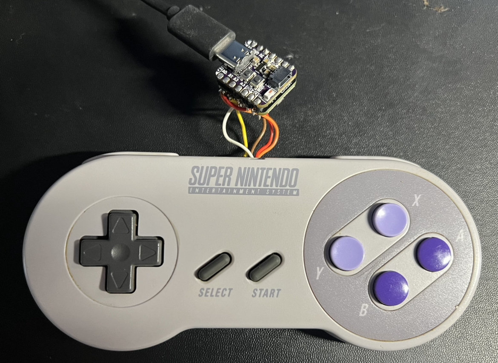

# SNES-controller
Embedding an [ESP32-s3](https://www.adafruit.com/product/5426) and rechargable battery in an original SNES controller to use for wireless input in other projects.

[SNES's original shift register](https://en.wikipedia.org/wiki/WDC_65C816) is wired directly into the ESP32-s3. It's small enough to fit inside the controller.

  

Given the experimental nature, loosely defined objectives, and my lack of experience with **ESP32**, **ESP-IDF**, **PlatformIO**, **FreeRTOS**, I consider this a prototype and eschewed writing tests and other formalities.

## Currently Working
- Hardware modification and soldering is done. Battery charging daughter board works.
- All button presses are reliably detected
- Simultaneous button press "combos" can have a callback attached
- - Combos are grouped so they can be enabled/disabled based on modal context
- Connects to WIFI, with SSID and password configured in advance
  - Currently only used to send a demo POST request when a certain combo is detected

## Future
- Actually control things with it! Via webservers, IFTTT, etc.
- Headless modal interface via SNES button combos
- Pull configuration updates from webserver
- Haptic motors, a display, or LED's for on-device feedback
- Reduce power consumption through heavy use of deep sleep and ULP coprocesser
- WiFi provisioning via BLE to a smartphone
- OTA firmware flashing

## Cost
- $47.50 current build with adafruit dev boards
- - $12.50 - [ESP32-s3](https://www.adafruit.com/product/5426)
- - $5.95 - [3.7v battery](https://www.adafruit.com/product/4237)
- - $4.95 - [battery charger](https://www.adafruit.com/product/5397)
- - $16.13 - used SNES controller (ebay)
- - ~$8.00 - taxes, shipping
- ~$30 est. with final aliexpress hardware
